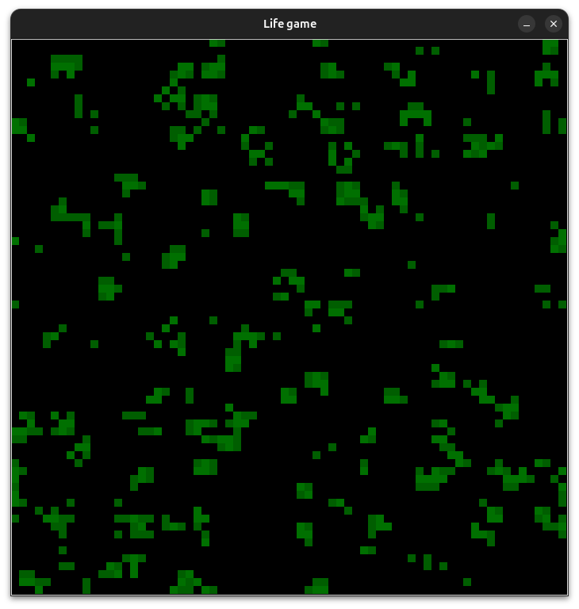
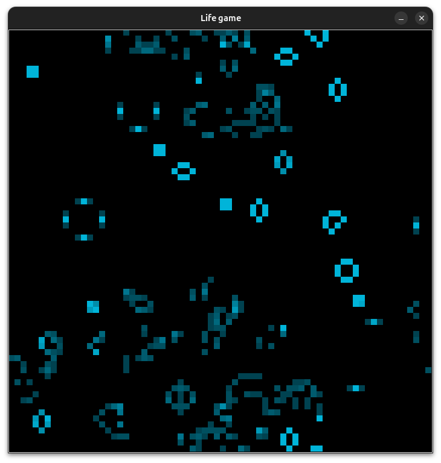
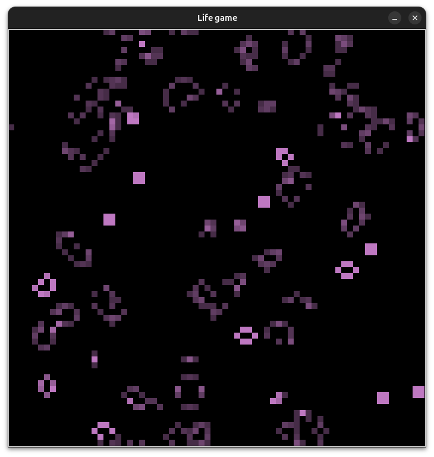
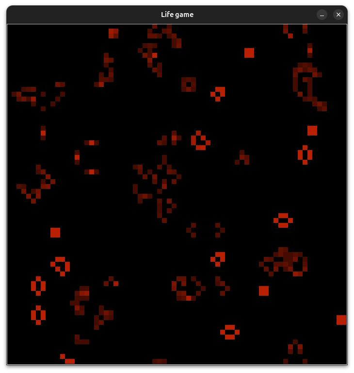
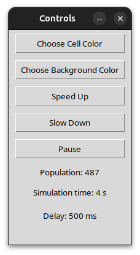

# Conway's Game of Life

## Description

Conway's Game of Life is a cellular automaton simulating the evolution of a population of cells on a two-dimensional grid. Each cell can be in one of two states: alive or dead. The state of the cells updates step-by-step according to simple rules based on the number of living neighbors.

Each live cell stores its age — the number of generations it has been alive. The cell’s color becomes brighter with age.

The grid uses cyclic boundaries, so cells on the edges consider neighbors from the opposite edge, creating a seamless wrap-around effect.

## Game Rules

Any live cell with fewer than two live neighbors dies (by loneliness).
Any live cell with two or three live neighbors stays alive.
Any live cell with more than three live neighbors dies (by overpopulation).
Any dead cell with exactly three live neighbors becomes alive (reproduction).
Neighbors are counted in all 8 directions around the cell (including diagonals).

## User Features

All next actions can be performed both via keyboard shortcuts and through the control panel interface

Press Space to pause or resume the simulation.
Press Down arrow to increase speed (reduce delay).
Press Up arrow to decrease speed (increase delay).
Press Escape to toggle the auxiliary control window.
In the control panel, click "Choose Cell Color" to select the main cell color.
In the control panel, click "Choose Background Color" to select the background color.
The control panel includes "Speed Up" and "Slow Down" buttons to adjust speed.
The control panel includes a "Pause" button to pause or resume the simulation.
Displays the current delay, the population count, and the elapsed simulation time in the control panel

## Screenshots

